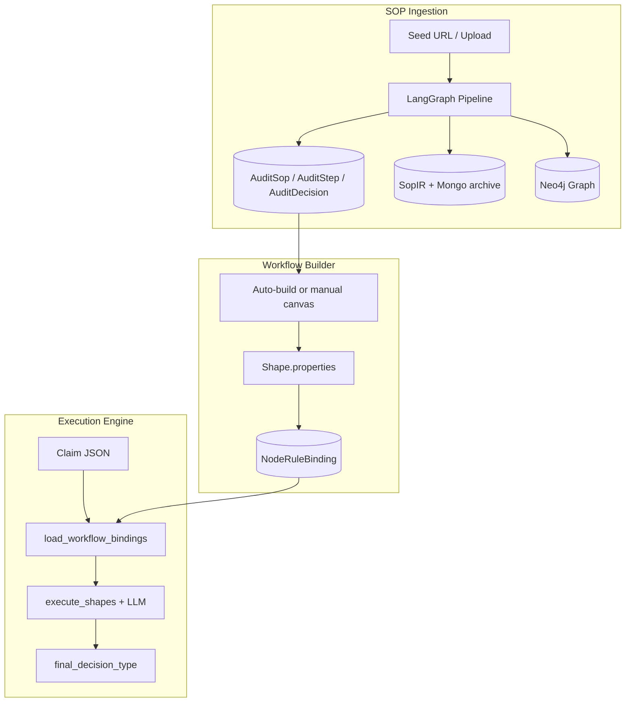

# Wipro UHC — Agentic Claims-Audit Platform

A Django backend that powers an end-to-end **claims-audit** workflow system: it ingests Standard Operating Procedure (SOP) documents into a structured, queryable knowledge base, lets auditors compose audit workflows on a drag-drop canvas, binds SOP rules and runtime API tools to canvas nodes, and runs live claims through those workflows with LLM-driven rule evaluation.

**Companion frontend:** `/opt/clients/toystack/uhc/frontend/claims-frontend` (Vite + React, `http://localhost:5173`).

---

## Table of contents

1. [What the platform does](#1-what-the-platform-does)
2. [End-to-end data flow](#2-end-to-end-data-flow)
3. [Repository layout](#3-repository-layout)
4. [Infrastructure & setup](#4-infrastructure--setup)
5. [SOP ingestion (`uhc-sop-ingestion`)](#5-sop-ingestion-uhc-sop-ingestion)
6. [Intermediate representation (`sop_ir`)](#6-intermediate-representation-sop_ir)
7. [Claims audit data model (`sop_ingestion`)](#7-claims-audit-data-model-sop_ingestion)
8. [Workflow builder & rule binding (`builder`)](#8-workflow-builder--rule-binding-builder)
9. [Agent tools (`agent_tools`)](#9-agent-tools-agent_tools)
10. [Execution engine (`uhc-execution-engine`)](#10-execution-engine-uhc-execution-engine)
11. [Runtime API agent (`uhc-api-agent`)](#11-runtime-api-agent-uhc-api-agent)
12. [REST API surface](#12-rest-api-surface)
13. [Environment variables](#13-environment-variables)
14. [Common operations](#14-common-operations)
15. [Tests](#15-tests)
16. [Glossary](#16-glossary)

---

## 1. What the platform does

The platform has four major capabilities. Each is backed by a Django app and/or an installable Python package:

| Capability | Package / app | Purpose |
|------------|---------------|---------|
| **SOP ingestion** | `uhc-sop-ingestion` + `sop_ingestion` | LangGraph pipeline: crawl/fetch HTML, DOCX, XLSX, PDF → parse → LLM enrich → canonical IR → persist Postgres + Neo4j + MongoDB + Redis |
| **Workflow builder** | `builder` | REST API for a server-driven drag-drop canvas; auditors lay out SOP steps as shapes and attach rules + tools |
| **Runtime API agent** | `uhc-api-agent` | Executes registered HTTP endpoints against claims data at runtime (auth, caching) |
| **Execution engine** | `uhc-execution-engine` + `execution_app` | Runs a claim through a built workflow: loads bindings, invokes tools, evaluates rules (LLM-assisted), produces audit decision |

**Critical architectural constraint:** The execution engine reads **Postgres bindings and audit rows at runtime**. It does **not** re-read the original PDF/HTML or any YAML seed file. Ingestion quality directly determines execution fidelity.

---

## 2. End-to-end data flow

```
┌─────────────────────────────────────────────────────────────────────────────┐
│  INGESTION                                                                  │
│  seed URL / upload → IngestionJob → LangGraph pipeline → AuditSop rows      │
│                    → SopIR (Pydantic) → Neo4j graph + Mongo IR archive      │
└─────────────────────────────────────────────────────────────────────────────┘
                                      │
                                      ▼
┌─────────────────────────────────────────────────────────────────────────────┐
│  BUILD (optional auto-build)                                                │
│  builder.sop_autobuild.build_workflow_for_job()                             │
│    AuditStep / AuditDecision → Shape nodes + Shape.properties.sop_rules     │
│    extract_bindings_from_properties() → NodeRuleBinding / NodeToolBinding   │
└─────────────────────────────────────────────────────────────────────────────┘
                                      │
                                      ▼
┌─────────────────────────────────────────────────────────────────────────────┐
│  CANVAS EDITING (SPA)                                                       │
│  GET/PUT /api/builder/workflows/{id}/graph/                               │
│    hydrate_properties_with_bindings() on read                             │
│    extract_bindings_from_properties() on save                              │
│    manual_oos_rule_keys / manual_in_scope_rule_keys on Shape.properties     │
└─────────────────────────────────────────────────────────────────────────────┘
                                      │
                                      ▼
┌─────────────────────────────────────────────────────────────────────────────┐
│  EXECUTION                                                                  │
│  claim + workflow_id → RuleEnginePipeline.run()                             │
│    load_workflow_bindings() → preconditions + decisions per shape           │
│    run_tools() → tool_results (lazy or eager)                               │
│    execute_shapes() → evaluate_one_rule() per rule (LLM)                    │
│    aggregate_decision() → final_decision_type + codes                       │
│    persist_and_respond() → RuleExecutionRun + RuleEvaluation rows           │
└─────────────────────────────────────────────────────────────────────────────┘
```

### Rule key format (stable identity)

Every attachable rule has a **`rule_key`** string used across builder, bindings, and execution:

| Source | Format | Example |
|--------|--------|---------|
| Precondition | `pre:{sop_id}:{precondition_id}:{idx}` | `pre:8:3:0` |
| Decision row | `step:{sop_id}:{step_number}:{row_index}` | `step:8:2:4` |
| Custom (canvas) | `custom:{uuid}` | `custom:abc-123` |

Nested sub-rules share the parent row's `row_index` in Postgres but may carry distinct `subrule_id` and `depth` on `AuditDecision`.

---

## 3. Repository layout

```
uhc-backend-v2/
├── sop_backend/                 Django project (settings, URLs, Celery)
├── builder/                     Workflow canvas CRUD, catalog, graph save, sop_autobuild
├── sop_ingestion/               Ingestion REST + Celery glue + Audit* ORM models
├── agent_tools/                 LangChain tool registry + NodeRuleBinding/NodeToolBinding
├── execution_app/               Claim execution runs, evaluations, batch SSE
├── sop_ir/                      Pydantic SopIR schema + persist_ir + normalize/plan/validate
├── uhc-sop-ingestion/           Editable pkg: LangGraph ingestion pipeline + CLI
├── uhc-api-agent/               Editable pkg: runtime HTTP execution pipeline + CLI
├── uhc-execution-engine/        Editable pkg: claim → workflow execution
├── yaml/                        Hand-authored SOP YAMLs (reference / import_sop_yaml)
├── sop_uploads/                 Uploaded PDFs/HTML from builder
└── graphify-out/                Codebase knowledge graph (graphify)
```

**Django `INSTALLED_APPS`:** `sop_ingestion`, `builder`, `agent_tools`, `execution_app`.

**Editable packages** (via `requirements.txt`): `uhc-sop-ingestion`, `uhc-api-agent`, `uhc-execution-engine`.

**API mounts** (`sop_backend/urls.py`):

| Prefix | App |
|--------|-----|
| `/api/ingest/` | `sop_ingestion` |
| `/api/builder/` | `builder` |
| `/api/agent-tools/` | `agent_tools` |
| `/api/execute/` | `execution_app` |
| `/api/claims/` | `execution_app` (trace/summary) |

---

## 4. Infrastructure & setup

### Requirements

- Python **3.13**
- PostgreSQL 16, Redis 7, Neo4j 5, MongoDB 7, RabbitMQ 3.13
- Anthropic + OpenAI API keys (ingestion enrichment + rule evaluation)

### Docker infrastructure

```bash
docker run -d -p 5432:5432  -e POSTGRES_PASSWORD=postgres postgres:16
docker run -d -p 6379:6379  redis:7
docker run -d -p 7474:7474 -p 7687:7687 -e NEO4J_AUTH=neo4j/test1234 neo4j:5
docker run -d -p 27017:27017 mongo:7
docker run -d -p 5672:5672 -p 15672:15672 rabbitmq:3.13-management
```

### Backend setup

```bash
python3.13 -m venv ../src
source ../src/bin/activate
pip install -r requirements.txt
cp .env.local .env    # edit for your machine
PYTHONPATH=. python manage.py migrate
PYTHONPATH=. python manage.py runserver 0.0.0.0:8000
```

### Celery (required for async SOP ingestion)

Ingestion uses a **master dispatcher**: Celery spawns one OS subprocess per `job_id`; the LangGraph pipeline runs in that subprocess (not inside the worker thread).

```bash
PYTHONPATH=. celery -A sop_backend worker -Q job_queue,celery --concurrency=1 -l INFO
export MAX_PIPELINE_SUBPROCESSES=10   # optional cap (default 10)
```

### Frontend

```bash
cd ../../frontend/claims-frontend
yarn install
yarn dev    # http://localhost:5173
```

### Authentication

`builder/auth.py` implements `CorebackendJWTAuthentication` — trusts HS256 JWTs from the Node `claims-corebackend` service. **`JWT_SECRET` must match** between both services.

---

## 5. SOP ingestion (`uhc-sop-ingestion`)

**Entry point:** `SopIngestionPipeline.run(seed_url)` in `uhc-sop-ingestion/src/uhc_sop_ingestion/pipeline.py`.

**Graph definition:** `uhc-sop-ingestion/src/uhc_sop_ingestion/graph.py` — wires **121 agent functions** across **18 stages** (`a01_intake` → `a18_ir_synthesis`).

**State:** `PipelineState` (`state.py`) uses `Annotated[list, operator.add]` accumulators so agents append without clobbering prior work.

**Observability:** Every stage and LLM call logs to Postgres (`PipelineStageLog`, `LLMCallLog`) and traces to **Langfuse** when configured.

### 5.1 Pipeline graph (high level)

```
START
  │
[intake_stage]     url_validator → url_normalizer → job_initializer
                   → redis_job_tracker → mongo_job_logger
  │
[pick_next_url]    BFS: next document URL or exit loop
  │
[fetch_stage]      depth_limit → http/local fetch → content detection
                   → hash → duplicate check
  │
  ├── HTML  → [html_parse]  ──────────────────────────────┐
  ├── DOCX  → [docx_parse]  ──────────────────────────────┤
  ├── XLSX  → [xlsx_parse]  ──────────────────────────────┤
  └── PDF   → [pdf_perceive] → [pdf_contextualize]         │
              → [pdf_synthesize] ──────────────────────────┤
                                                           │
              [enrich_stage]  (HTML/DOCX/XLSX only) ◄──────┘
              [context_stage]
              [validate_stage]
              [narrative_stage]
              [graph_synthesis_stage]
              [ir_synthesis_stage]
              [write_neo4j] → [write_postgres] → [write_mongo] → [write_redis]
              [link_stage]
              [completion_check] → loop or [final_stage] → END
```

**Routing:** `_route_after_fetch` branches on `doc_format` (`HTML`, `DOCX`, `XLSX`, `PDF`). Duplicates skip parse and go straight to `link_stage`.

**Convergence:** HTML/DOCX/XLSX paths enter `enrich_stage` then join PDF at `context_stage`. Both doors produce the same downstream shape: `steps`, `pre_sections`, codes, graph nodes, and eventually `sop_ir`.

### 5.2 Intake & fetch agents

| Stage | Module | Agents |
|-------|--------|--------|
| `intake_stage` | `a01_intake.py` | `url_validator`, `url_normalizer`, `job_initializer`, `redis_job_tracker`, `mongo_job_logger` |
| `pick_next_url` | `a02_fetch.py` | `next_url_picker` |
| `fetch_stage` | `a02_fetch.py` | `depth_limit_checker`, `http_fetcher`, `local_file_fetcher`, `content_type_detector`, `extension_detector`, `magic_bytes_detector`, `content_hasher`, `duplicate_checker` |

Local uploads from the builder arrive as `file://` URLs under `sop_uploads/`.

### 5.3 HTML parse door (`a03_parse_html.py`)

**Design principle:** Zero hardcoded CSS class names. Detection uses content heuristics and structural patterns.

| Agent | Detection strategy | Output state keys |
|-------|-------------------|-----------------|
| `html_decode` | Validate bytes / charset | `parse_warnings` |
| `html_metadata` | `<title>`, `<h1>`, date regexes | `metadata` |
| `html_biz_table` | Header row mentions Platform/Audience/LOB | `metadata` (platform, lob, audience, …) |
| `html_pre_sections` | Label+content row pattern in non-step tables | `pre_sections` |
| `html_steps` | Column of consecutive integers 1,2,3… | `steps` (primary procedure) |
| `html_step_inventory` | Walk doc in order; claim every `Step N` heading/table | `step_inventory`, `step_checklist`; prunes duplicate pre-sections |
| `html_decision_tables` | Inner 2-col IF→THEN tables | `steps[].decision_rows` |
| `html_compound_tables` | Inner 3-col IF/AND/THEN tables | `steps[].decision_rows` |
| `html_group_tables` | Time-period keywords (days/months/years) | `group_rules` |
| `html_annotations` | Highlight colours, Note:/Alert: prefixes | `annotations` |
| `html_reference_tables` | Valid/Invalid POTF attachment lists | `reference_tables` |
| `html_sub_procedures` | Secondary integer-sequence tables (e.g. ERB) | `sub_procedures` |
| `html_links` | All `<a href>` | `links` |

**Multi-procedure handling (HTML):** `_find_step_tables` returns all integer-sequence tables. The primary table (starts at 1, most rows) becomes `steps`; others become `sub_procedures` via `html_sub_procedures`.

**Step inventory safety net:** Many real SOPs lay out each step as its own table rather than one master Step/Action table. `html_step_inventory` walks headings and tables in document order so those steps are not swallowed into pre-sections and re-emerged as a mega "Step 0".

### 5.4 PDF vision door (three stages)

PDFs lack DOM structure. The PDF door uses **multimodal perception** (page images + optional native PDF) and a **Redis-backed shared context graph** before synthesis.

#### Stage 1: `pdf_perceive` (`a06c_pdf_perception.py`)

| Agent | Role |
|-------|------|
| `pdf_metadata` | Title, page count, format hints |
| `pdf_slicer` | Rasterize pages; **band-split** tall pages for LLM image limits |
| `pdf_page_reader` | Multimodal perception per band → verbatim page records in Redis `slices` |
| `pdf_perception_merger` | Stitch band results into unified `pages` list |

Band overlap can duplicate section text; downstream dedup handles this.

#### Stage 2: `pdf_contextualize` (`a06d_pdf_context_graph.py`)

| Agent | Role |
|-------|------|
| `pdf_entity_extractor` | STEP, SECTION, CONDITION, TABLE, ROW, NOTE entities → Redis `entities` |
| `pdf_relation_reasoner` | HAS_ROW, CONTAINS, GOTO relations → Redis `relations` |
| `pdf_context_graph_writer` | Persist graph snapshot |
| `pdf_context_validator` | Completeness checks |
| `pdf_step_reconciler` | **Holistic step plan** over whole document → Redis `step_plan` |

**Holistic reconstruction (`_holistic_step_plan`):** Re-threads orphaned If/Then rows (whose "Step" column was lost across page breaks) back to owning steps. Separates **independently numbered sub-procedures** (e.g. Emergency Response Bulletins) with a running offset so step numbers never collide.

**Primary procedure rule:** Only the first procedure (post sort) owns base `1..N`; later procedures are offset deterministically.

#### Stage 3: `pdf_synthesize` (`a06e_pdf_synthesis.py`)

| Agent | Role |
|-------|------|
| `pdf_step_synthesizer` | Per-step LLM synthesis from page span → `steps[]` with nested `decision_rows` / `subrules` |
| `pdf_presection_synthesizer` | SECTION entities → `pre_sections` |
| `pre_section_rule_extractor` | LLM extracts exception rules + nested `sub_rules` (TIN lists verbatim) |
| `group_rule_extractor` | Timely-filing-style group limits |
| `date_condition_extractor` | Date applicability |
| `summary_generator` | Executive summary |
| `pdf_quality_gate` | `SopIR.model_validate` + completeness flags |

**Per-step synthesis:** Reads each step's **exact page set** from `step_plan` (often non-contiguous). Uses `retry_on_truncation` on dense steps so JSON output is not silently truncated.

**Operative identifier lists:** Excluded provider TIN/NPI tables must appear as decision rows with each entry in nested `subrules` — never collapsed to "TIN is one of: …".

**Out of scope vs stop (ingestion semantics):**

| Concept | Meaning | `is_out_of_scope` |
|---------|---------|-------------------|
| **Out of scope** | Engine **skips** the line — no defect, no EOB | `true` |
| **Stop / terminal** | Process ends with **defect + EOB code** | `false` (disposition in `action`) |

**Exception attacher (`pdf_exception_attacher`):** Attaches preamble exception rules (e.g. excluded-TIN table) to the host numbered step that references provider/TIN criteria (typically Step 2 in Duplicate Claim Handling). Records signatures in `exception_rules_attached` so Step 0 is not duplicated.

**Dedup (`dedupe_exception_rules`):** Collapses band-overlap duplicates by **identifier set** (TIN/NPI cluster with majority overlap), not exact gate wording — prevents Step 0 from showing 120 rows when the PDF has 40 providers.

### 5.5 Shared enrich stage (`a07_enrich.py`)

Runs for **HTML/DOCX/XLSX** after parse. PDF runs equivalent extractors inside `pdf_synthesize`, then both paths hit `pdf_exception_attacher` again in `enrich_stage`.

| Agent | Provider | Role |
|-------|----------|------|
| `step_checklist_reconciler` | Anthropic | Ensures every inventoried step number appears in `steps` |
| `step_question_refiner` | Anthropic | **Faithful** copy-edit only; `_safe_question_rewrite` rejects hallucinated rewordings |
| `decision_row_classifier` | Anthropic | DENY/ALLOW/BYPASS/… classification |
| `rule_semantic_enricher` | Anthropic | `action_line`, `action_claim` extraction |
| `cross_reference_resolver` | OpenAI | Resolve referenced SOP names |
| `ambiguous_term_resolver` | Anthropic | Disambiguate terms |
| `potf_validator` | Anthropic | Valid/Invalid POTF attachment rules |
| `pre_section_rule_extractor` | Anthropic | Exception rules with nested `sub_rules`; dedup instruction |
| `group_rule_extractor` | Anthropic | Group timely-filing limits |
| `date_condition_extractor` | Anthropic | Date conditions |
| `summary_generator` | Anthropic | SOP purpose summary |
| `pdf_exception_attacher` | — | Attach exceptions to host step (PDF jobs) |

**LLM guardrails (`_llm_call`):** Primary → retry → cross-provider fallback → salvage truncated JSON. `retry_on_truncation` doubles token budget up to 32k before salvage on dense steps.

### 5.6 Context, validate, narrative, graph synthesis

| Stage | Agents (summary) |
|-------|------------------|
| `context_stage` | Code detectors: EOB, EX, denial, POS, revenue, bill type, modifier, frequency, system action, CPT, entity lists; `code_deduplicator` |
| `validate_stage` | `document_completeness`, `step_sequence`, `decision_row_check`, `code_system_check`, `link_validator`, `metadata_validator` |
| `narrative_stage` | `sop_overview_narrator`, `step_narrative_writer` → `AuditSop.narrative_context`, `AuditStep.narrative_context` |
| `graph_synthesis_stage` | Agentic Neo4j graph: profiler, pre-section synthesizer, step decomposer, decision classifier, code grounder, reference resolver, semantic edge reasoner, assembler |
| `ir_synthesis_stage` | `ir_maker`, `ir_checker` → `state["sop_ir"]` |

### 5.7 Write stage

| Node | Module | Writes |
|------|--------|--------|
| `write_neo4j` | `a10_write_neo4j.py` | SOP, Step, Decision, PreSection, Code, Reference nodes + edges; `html_dom_writer` for HtmlBlock cross-links |
| `write_postgres` | `a11_write_postgres.py` | `AuditSop`, `AuditPrecondition`, **Step 0** (exceptions), `AuditStep`, `AuditDecision`, codes, annotations, graph mirror |
| `write_mongo` | `a12_write_mongo.py` | Raw document blobs |
| `write_redis` | `a13_write_redis.py` | Job blackboard / context keys |
| `link_stage` | `a14_links.py` | BFS link queue, unresolved refs |

**Step 0 (`pg_precondition_writer`):** Promotes exception-type pre-section rules to synthetic **Step 0 — Pre-Step Exceptions & Override Rules** with nested child `AuditDecision` rows (`depth=1`, `parent_id`). Skips rules already attached to a numbered step. Uses `dedupe_exception_rules` before insert.

**IR persist gate:** When `SOP_IR_PERSIST` is on (default), `sop_ir.persist.persist_ir` is the **authoritative** writer for steps ≥ 1; flat `pg_step_writer` defers to it. Step 0 from preconditions still writes via `pg_precondition_writer`.

**Post-run:** `sop_ingestion/pipeline_runner.py` calls `persist_ir` and optionally `build_workflow_for_job` when `workflow.metadata.auto_build_canvas` is true.

---

## 6. Intermediate representation (`sop_ir`)

**Path:** `sop_ir/schema.py`, `persist.py`, `plan.py`, `normalize.py`, `validate.py`

The IR mirrors hand-authored `yaml/*.yaml` shape so ingested SOPs route identically to YAML-imported ones.

### 6.1 Pydantic models

| Class | Role |
|-------|------|
| `SopIR` | Root: `metadata: SopMetadata`, `rules: List[RuleNode]` |
| `RuleNode` | One top-level rule → one `AuditStep` + decision subtree |
| `Subrule` | Recursive If/Then row → `AuditDecision` with `parent` FK |
| `Navigation` | Structured `{op: goto\|stop\|next\|proceed, step_number?}` |
| `DecisionType` | DENY, ALLOW, BYPASS, PEND, REFER, SYSTEM, STOP, WAIVE, CONDITIONAL |
| `Aggregation` | FIRST_MATCH, XOR_ONE, APPLICABLE_ONLY, ALWAYS_MET, ANY, LEAF |

### 6.2 `persist_ir(sop_id, ir, job_id=…)`

1. Wipes/rebuilds `AuditStep` + nested `AuditDecision` (optional `preserve_step_numbers`, e.g. `{0}` for pipeline Step 0)
2. Updates `AuditSop.step_count`, `decision_count`
3. Creates `SopIRDocument` head row in Postgres
4. Archives full IR JSON to MongoDB `sop_ir_documents` (`_id` = `{sop_id}:{ir_version}`) when `MONGO_HOST` set

**Flag:** `SOP_IR_PERSIST` — default **ON**; set `0|false|no|off` to opt out.

### 6.3 Supporting modules

| Module | Role |
|--------|------|
| `plan.py` | `plan_ir(ir)` → list of step/decision dicts for writers |
| `normalize.py` | `classify_decision`, `extract_codes`, `extract_goto`, `is_out_of_scope`, `infer_aggregation` |
| `validate.py` | `validate_ir(ir)` → routing invariants (missing goto targets, duplicate step numbers) |

### 6.4 YAML import (offline)

```bash
PYTHONPATH=. python manage.py import_sop_yaml path/to/sop.yaml
```

Runs: YAML → `SopIR` → `validate_ir` → `persist_ir`.

---

## 7. Claims audit data model (`sop_ingestion`)

**Path:** `sop_ingestion/models.py`

### 7.1 Ingestion job tracking

| Model | Key fields |
|-------|------------|
| `IngestionJob` | PK `job_id` (UUID), `seed_url`, `status`, `docs_queued/processed/failed`, `max_depth`, `max_docs`, LLM totals, FK → `builder.Workflow` |
| `IngestedDocument` | `url`, `content_hash`, `doc_format`, `depth`, `neo4j_sop_id`, `pg_sop_id` |
| `PipelineStageLog` | Per-stage timing, `stage_name`, `status`, `error_detail` |
| `LLMCallLog` | Agent name, provider, tokens, duration (ingestion or execution runs) |

### 7.2 Audit trail (what auditors and engine read)

| Model | Key fields |
|-------|------------|
| `AuditSop` | `title`, `purpose`, `llm_summary`, `narrative_context`, `platform`, `lob[]`, `audience[]`, counts |
| `AuditPrecondition` | `label`, `content_text`, **`llm_rules`** (JSON array) |
| `AuditStep` | `step_number`, `question`, `intro_text`, `is_terminal`, **`is_out_of_scope`**, `narrative_context` |
| `AuditDecision` | `condition_if`, `condition_and`, `action_text`, `decision_type`, `goto_step`, `is_final`, **`is_out_of_scope`**, `depth`, `parent` (self-FK), `subrule_id`, `row_index`, `aggregation`, `applicable_when`, code JSON fields |
| `AuditGroupLimit` | Timely filing group limits |
| `AuditCode` | EOB/EX/denial codes |
| `AuditGraphNode` / `AuditGraphEdge` | Knowledge graph mirror |
| `SopExclusion` | User exclusions: `target_kind` (rule/step/section/sop/…), `target_key` |
| `SopIRDocument` | IR version head, `mongo_ref`, `validation_status` |

**Nesting:** Parent `AuditDecision` rows have `depth=0`; child sub-rules (e.g. TIN→provider name) have `depth=1`, `parent_id` set.

---

## 8. Workflow builder & rule binding (`builder`)

### 8.1 Canvas hierarchy

```
Workflow
  └── WorkArea (lane)
        └── Workbench (sub-canvas, kind="SOP")
              └── Shape (xyflow node)
                    properties JSONB: { sop_rules[], tool_calls[], manual_oos_rule_keys[], manual_in_scope_rule_keys[], … }
              └── ShapeConnection (edges)
```

| Model | Role |
|-------|------|
| `ShapeDefinition` | Palette template; **`property_schema`** drives SPA inspector (no frontend deploy for new fields) |
| `ShapeCategory` | Palette grouping |
| `NavItem`, `DashboardWidget` | Server-driven UI |

### 8.2 Auto-build (`builder/sop_autobuild.py`)

**Trigger:** Workflow create/attach with `auto_build_from_sop=true` → `metadata.auto_build_canvas=True`.

**Entry:** `build_workflow_for_job(workflow, job)` from `pipeline_runner._maybe_auto_build_workflow`.

**Steps:**
1. Load all `AuditSop` for job; dedupe by URL (latest wins)
2. Delete existing work areas; create "Claim Audit" lane
3. Per SOP: workbench column; optional Preconditions diamond if no Step 0 with decisions
4. Per `AuditStep`: split decisions (`_split_decisions`, max 6 rules/node); create shapes; `_hydrate_decision`; `extract_bindings_from_properties`; linear connections
5. Chain columns; set `metadata.auto_build_complete=True`, `needs_tools=True`

### 8.3 Rule binding sync (`builder/bindings_sync.py`)

#### Write: `extract_bindings_from_properties(shape)`

1. Read `shape.properties["sop_rules"]` and `["tool_calls"]`
2. Persist scope override key lists on shape:
   - `manual_oos_rule_keys` — keys where `manual_out_of_scope == true`
   - `manual_in_scope_rule_keys` — keys where `manual_in_scope == true` (**force back in scope**)
3. **Delete + reinsert** `NodeRuleBinding` rows (condition, action, ordering, references, html_reference)
4. **Delete + reinsert** `NodeToolBinding` rows linked to tools and optional rule bindings

Called on graph PUT and shape CRUD.

#### Read: `hydrate_properties_with_bindings(shape, oos_keys=None)`

1. Merge DB bindings back into `properties["sop_rules"]`, preserving unbound custom rules
2. Compute effective out-of-scope per rule:

```
sop_oos     = from AuditDecision / AuditStep via _rule_keys_out_of_scope()
manual_oos  = key in manual_oos_rule_keys
forced_in   = key in manual_in_scope_rule_keys   ← WINS over everything

effective_oos = (manual_oos OR sop_oos) AND NOT forced_in
```

3. Shape rollup: `oos_rule_count`, `rule_count`, `is_out_of_scope` (all rules OOS)
4. Whole-node override: `manual_out_of_scope` on shape forces entire node OOS

**Preconditions** (`pre:…` keys) are never SOP-derived OOS.

#### Batch optimization

`out_of_scope_keys_for_shapes(shapes)` — one `AuditDecision` query for entire workflow graph GET.

### 8.4 Canvas rule editing (frontend)

**Path:** `claims-frontend/src/routes/workflows/components/NodeAttachments/AttachedRuleCard.tsx`

Per-rule actions (labeled buttons):
- **Mark out of scope** / **Mark in scope** — toggles `manual_out_of_scope` / `manual_in_scope`
- **Add sub-rule**, **Add/Edit context**, **Exclude rule**

Scope toggle persists via graph save → `extract_bindings_from_properties`.

---

## 9. Agent tools (`agent_tools`)

### 9.1 Models

| Model | Role |
|-------|------|
| `Tool` | Registry entry: `name`, `invoke_url`, `args_schema`, `kind` (langchain/api_agent) |
| `NodeRuleBinding` | FK → `Shape`, FK → `AuditSop`; `rule_key`, `condition`, `action`, `ordering` |
| `NodeToolBinding` | FK → `Shape`, `Tool`, optional `NodeRuleBinding` |
| `SopFieldMapping` | Maps SOP business fields → claim/tool paths (DB-first; YAML fallback) |
| `ClaimOntologyField` | Canonical claim field ontology |
| `McpServerConfig` | External MCP tool server |

### 9.2 Registry (`agent_tools/registry.py`)

- `iter_tools()` — lazy LangChain `StructuredTool` factories (doc360, facets, cbd, linx, cross_prevalence, llm_claim_parser, …)
- `sync_to_db()` — upsert `Tool` rows; `invoke_url` = `/api/agent-tools/{name}/invoke`

```bash
PYTHONPATH=. python manage.py sync_tool_registry
```

### 9.3 Invoke

```http
POST /api/agent-tools/{name}/invoke
Content-Type: application/json

{"args": { ... }}
```

Runs `graphs.single_tool_graph.run_tool()`.

---

## 10. Execution engine (`uhc-execution-engine`)

**Entry:** `RuleEnginePipeline.run()` in `pipeline.py`.

**Graph:** 6 sequential nodes (`graph.py`) — no separate n04/n05; per-shape evaluation lives in `execute_shapes`.

```
START → validate_input → load_bindings → run_tools → execute_shapes
      → aggregate_decision → persist_and_respond → END
```

### 10.1 Nodes

| Node | Module | Role |
|------|--------|------|
| `validate_input` | `n01_validate.py` | Require `workflow_id` + claim dict; create `RuleExecutionRun` (RUNNING) |
| `load_bindings` | `n02_load_bindings.py` | `load_workflow_bindings(workflow_id)` → preconditions, decisions, shapes, tools maps |
| `run_tools` | `n03_run_tools.py` | Eager tool invocation unless `lazy_tools=True` (default: defer to execute_shapes) |
| `execute_shapes` | `n_execute_shapes.py` | Phase 1: preconditions; Phase 2: per-SOP step cursors; LLM `evaluate_one_rule` per rule |
| `aggregate_decision` | `n06_aggregate.py` | Precedence: DENY > STOP > PEND > REFER > … > ALLOW; LLM tie-break on adverse rules |
| `persist_and_respond` | `n07_persist_respond.py` | Bulk create evaluations + tool records; build trace |

### 10.2 `load_workflow_bindings(workflow_id)`

Returns:

```python
{
    "preconditions": [rule_dict, ...],
    "decisions":     [rule_dict, ...],
    "tools_by_rule_key": {rule_key: [tool_binding_dict, ...]},
    "tools_by_shape":    {shape_id: [...]},
    "all_tool_bindings": [...],
    "shapes": [{
        "shape_id", "shape_label", "workbench", "shape_order",
        "rules": [...], "tool_bindings": [...]
    }, ...]
}
```

**Hydration sources:**
- Preconditions: `AuditPrecondition.llm_rules[idx]` + `NodeRuleBinding` overrides
- Decisions: `AuditStep` + `AuditDecision` + binding overrides
- Custom rules: `Shape.properties.sop_rules` without binding rows (`custom:…` keys)

**Scope flags on each rule dict:**

| Flag | Set when | Runtime behavior |
|------|----------|------------------|
| `is_out_of_scope` | SOP step/decision flagged, unless forced in | Skip without LLM if not `is_final`; matched OOS → clean stop for SOP |
| `manual_oos` | `manual_out_of_scope`, `manual_oos_rule_keys`, or whole-node OOS; cleared by `manual_in_scope_rule_keys` | Skip without LLM; cursor continues |
| `manual_in_scope` | (hydration only) | Forces `is_out_of_scope=False`, `manual_oos=False` |

### 10.3 Rule evaluation (`_eval_common.evaluate_one_rule`)

- One LLM call per non-skipped rule (Anthropic primary, OpenAI fallback)
- Prompt: condition, action, claim JSON, compacted tool context, mapped SOP fields
- Required JSON keys: `matched`, `reasoning`, `confidence`
- Optional: `applicable`, `navigation`, `status`, `evidence_refs`
- Effective match: `matched and applicable` (default applicable=true)
- `applicable_when` guard → SKIPPED (not Met/Not-Met)

### 10.4 Routing inside `execute_shapes`

Per SOP, independent step cursors:

1. Evaluate applicable rules on current step
2. **Matched out-of-scope** → clean stop (remaining steps SKIPPED for that SOP)
3. **goto** (LLM navigation or `goto_step`) → jump forward only
4. **Matched DENY/STOP** (non-OOS) → `TERMINATED_EARLY` (whole claim)
5. **Matched is_final** or navigation stop → clean stop
6. Else → next sequential step
7. `aggregation=="APPLICABLE_ONLY"`: first matching sibling skips rest without LLM

Loop guard: `max_hops = len(steps) * 3 + 10`.

### 10.5 Aggregation (`aggregate_decision`)

Matched rules exclude `skipped` and `is_out_of_scope`.

| Case | Outcome |
|------|---------|
| `TERMINATED_EARLY` | Last matched DENY/STOP drives verdict |
| No matches | Deterministic ALLOW |
| No adverse disposition | ALLOW, or REFER/INCONCLUSIVE if relied-on tools failed |
| Adverse matches | LLM precedence call; fallback picks highest-precedence `decision_type` |

### 10.6 Supporting modules

| Module | Role |
|--------|------|
| `claim_fetcher.py` | Outer claim fetch + optional ontology parse |
| `field_mapping.py` | Resolve SOP fields from claim + tool results |
| `tool_runner.py` | Invoke registry tools; MCP routing when configured |
| `llm.py` | Guarded dual-provider LLM + Langfuse + Redis SSE events |
| `batch.py` | `BatchRunner`: xlsx → per-claim pipeline |
| `xlsx_parser.py` | Extract claim IDs from upload spreadsheet |

### 10.7 Execution persistence (`execution_app`)

| Model | Role |
|-------|------|
| `BatchExecutionRun` | Spreadsheet batch metadata |
| `RuleExecutionRun` | One claim run: status, `final_decision_type`, `applied_codes`, `narrative` |
| `RuleEvaluation` | Per-rule: `matched`, `skipped`, `reasoning`, `decision_type`, `codes` |
| `ToolInvocationRecord` | Tool name, phase (FETCH/PARSE/EVALUATE), args, result |
| `ClaimTrace` | `trace_json`, `explainability_json` |

---

## 11. Runtime API agent (`uhc-api-agent`)

Small LangGraph pipeline for direct HTTP tool execution outside the main execution graph.

```bash
api-agent call https://api.example.com/v1/endpoint --bearer sk-xyz
api-agent register https://api.example.com/v1/endpoint --bearer sk-xyz
```

Used by `agent_tools` for `kind=api_agent` tools and standalone CLI testing.

---

## 12. REST API surface

### 12.1 Ingestion — `/api/ingest/`

| Method | Path | Purpose |
|--------|------|---------|
| GET | `/health/` | Package/Celery health |
| GET/POST | `/` | List jobs / start async ingestion (202) |
| GET/DELETE | `/{job_id}/` | Poll / delete job |
| POST | `/run-sync/` | Inline pipeline (DEBUG only) |
| GET | `/{job_id}/graph/` | Knowledge graph JSON |
| GET | `/{job_id}/sections/` | Structured SOP JSON |
| POST | `/{job_id}/contextualize/` | Re-run narrative agents |
| GET/POST | `/sops/{sop_id}/exclusions/` | SopExclusion CRUD |
| POST | `/sops/{sop_id}/exclusions/toggle/` | Idempotent toggle |
| GET | `/sops/{sop_id}/html-blocks/` | HTML blocks |
| GET | `/sops/{sop_id}/source-html/` | Sanitized source |
| GET | `/sops/{sop_id}/dom-tree/` | DOM mirror |
| GET | `/viewer/{job_id}/doc/{doc_id}/` | HTML viewer |

### 12.2 Builder — `/api/builder/`

| Method | Path | Purpose |
|--------|------|---------|
| GET | `/catalog/categories/`, `/catalog/shapes/` | Drag palette |
| GET | `/ui/navigation/`, `/ui/dashboard/` | Server-driven UI |
| GET/POST | `/workflows/` | Workflow CRUD |
| **GET/PUT** | `/workflows/{id}/graph/` | **Atomic canvas load/save** |
| GET | `/workflows/{id}/build_status/` | Auto-build progress |
| GET | `/workflows/{id}/build_stream/` | SSE stage log during build |
| GET | `/workflows/{id}/attachable/` | Rule + tool picker data |
| POST | `/workflows/{id}/attach/` | Attach SOP URLs (202) |
| POST | `/workflows/sop_upload/` | Multipart upload → `file://` URL |
| POST | `/workflows/create_from_upload/` | Upload + workflow + ingest |
| POST | `/workflows/{id}/duplicate/` | Clone graph |

### 12.3 Agent tools — `/api/agent-tools/`

| Method | Path | Purpose |
|--------|------|---------|
| GET | `/` | List tools |
| GET | `/{name}/` | Tool schema |
| POST | `/{name}/invoke` | Execute tool |
| CRUD | `/field-mappings/`, `/claim-ontology/` | Mapping admin |

### 12.4 Execution — `/api/execute/`

| Method | Path | Purpose |
|--------|------|---------|
| POST | `/workflows/{id}/run-batch/` | Sync batch from xlsx |
| POST | `/workflows/{id}/run-batch-async/` | Async batch (202 + SSE) |
| GET | `/batches/{id}/events/` | SSE progress |
| GET | `/runs/`, `/runs/{id}/` | Run list/detail |
| GET | `/runs/{id}/nodes/` | Per-shape rollup |

### 12.5 Claims trace — `/api/claims/`

| Method | Path | Purpose |
|--------|------|---------|
| GET | `/{claim_id}/summary/` | Header + agent summaries |
| GET | `/{claim_id}/agents/` | Per-node evaluations |
| GET | `/{claim_id}/trace/` | Full trace JSON |
| GET | `/{claim_id}/explainability/` | Explainability JSON |

---

## 13. Environment variables

Create `.env` (see `.env.local` / `.env.prod` for references).

```bash
# Databases
PG_HOST / PG_PORT / PG_USER / PG_PASSWORD / PG_DATABASE
REDIS_HOST / REDIS_PORT
NEO4J_HOST / NEO4J_PORT / NEO4J_USER / NEO4J_PASSWORD
MONGO_HOST / MONGO_PORT / MONGO_DATABASE
RABBITMQ_USER / RABBITMQ_PASSWORD / RABBITMQ_HOST / RABBITMQ_PORT

# LLM
ANTHROPIC_API_KEY
OPENAI_API_KEY
ANTHROPIC_MODEL          # default claude-sonnet-4-5-20250929
OPENAI_MODEL             # default gpt-4o

# Observability
LANGFUSE_PUBLIC_KEY / LANGFUSE_SECRET_KEY / LANGFUSE_HOST

# Django
DJANGO_SECRET_KEY / DJANGO_DEBUG / DJANGO_ALLOWED_HOSTS
CORS_ORIGINS=http://localhost:5173

# JWT (must match claims-corebackend)
JWT_SECRET

# Pipeline tuning
MAX_DEPTH=4
MAX_DOCS=200
MAX_PIPELINE_SUBPROCESSES=10
SOP_IR_PERSIST=1         # set 0 to disable canonical IR persist gate

# Execution engine
LAZY_TOOLS=1             # defer evaluate-phase tools to execute_shapes
```

Tool-specific secrets: `agent_tools/.env.tools`.

---

## 14. Common operations

### Trigger ingestion

```bash
curl -X POST http://localhost:8000/api/ingest/ \
  -H 'Content-Type: application/json' \
  -d '{"seed_url": "file:///path/to/sop_uploads/my_sop.pdf"}'
```

Or: builder **Create from upload** / attach SOPs to workflow with `auto_build_from_sop=true`.

### CLI

```bash
sop-ingest http://example.com/sop.html
```

### Reclassify decision types (in place)

```bash
PYTHONPATH=. python manage.py reclassify_decisions
```

### Flush audit data (destructive)

```bash
PYTHONPATH=. python manage.py flush_audit_data --yes
```

### Inspect ingested SOP in DB

```bash
PYTHONPATH=. python manage.py shell -c "
from sop_ingestion.models import AuditSop, AuditStep, AuditDecision
sop = AuditSop.objects.order_by('-id').first()
print(sop.title, sop.id)
for st in AuditStep.objects.filter(sop=sop).order_by('step_number'):
    n = AuditDecision.objects.filter(step=st).count()
    print(f'  step {st.step_number}: {n} decisions — {st.question[:50]}')
"
```

---

## 15. Tests

```bash
pytest agent_tools/tests/ -v
pytest execution_app/tests/ -v
pytest sop_ir/tests/ -v
```

Key parity test: `sop_ir/tests/test_roundtrip.py` asserts IR enums match `AuditDecision` choices.

---

## 16. Glossary

| Term | Meaning |
|------|---------|
| **SOP** | Standard Operating Procedure document governing claims handling |
| **IR** | Intermediate Representation — Pydantic `SopIR` canonical form |
| **Step 0** | Synthetic pre-step holding global exception/override rules before numbered steps |
| **Binding** | `NodeRuleBinding` row linking a canvas shape to an audit rule by `rule_key` |
| **Out of scope** | Rule/step skipped by engine — **no defect, no EOB** |
| **Stop / terminal** | Claim path ends with defect + EOB codes — **not** out of scope |
| **Force in scope** | Auditor override via `manual_in_scope_rule_keys` — re-enables SOP-flagged OOS rules |
| **Operative identifier list** | TIN/NPI/provider table gating a rule — each entry is a nested sub-rule |
| **Band overlap** | PDF perception splits tall pages into overlapping vertical slices → duplicate text |
| **Holistic step plan** | Whole-document LLM pass assigning exact page sets per step number |
| **Lazy tools** | Execution defers evaluate-phase tool calls until first rule on that shape |

---

## Architecture diagram (mermaid)



---

*Built by toystack AI*
