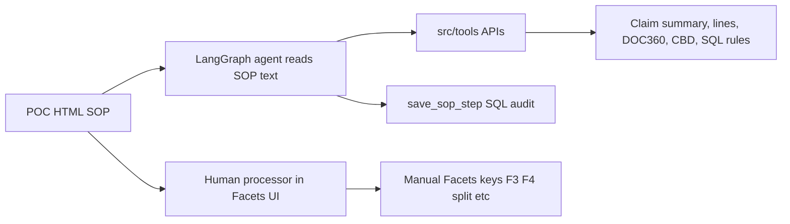

# `poc/` — OBH Facets SOP Reference Documents (HTML)

Each folder under `poc/` is a **static HTML transcription** of an official **UnitedHealth / Optum OBH (Optum Behavioral Health)** Facets **Procedure & Policy (P&P)** document. They were built from training videos and PDF screenshots so processors, auditors, and **AI agents** can read the same rules humans follow in Facets.

**Important:** POC HTML is **not wired to Python**. There is no JavaScript and no API calls. [`../src/README.md`](../src/README.md) describes the **tools** that can supply data for many of these steps; Facets **UI actions** (F3, split claim, overrides) remain manual unless automated elsewhere.

---

## What each POC is for (one sentence each)

| Folder | What it tells you |
|--------|-------------------|
| [`claims_spanning_eligibility_dates`](#claims_spanning_eligibility_dates) | When error **50507** fires because DOS cross an eligibility change — check benefits, then **split** the claim. |
| [`duplicate_claim_handling`](#duplicate_claim_handling) | How to handle **DUPS** warnings, cross-billing prevailing codes, geographic/facility exceptions, and duplicate review matrices. |
| [`obh_facets_timely_filing`](#obh_facets_timely_filing) | Full **timely filing** decision tree: TFF vs TFO, COB, POTF, overrides, history search. |
| [`timely_filing_050526`](#timely_filing_050526) | **Same SOP** as timely filing above — second video/PDF pass (`OBH Facets Timely Filing_050526.pdf`). |
| [`provider_selection_guidelines`](#provider_selection_guidelines) | How to pick the **correct provider record** and when to route to other P&Ps. |
| [`physician_claim_checklist`](#physician_claim_checklist) | **Mandatory checklist** before processing physician adjustments/resubmissions. |

---

## Shared structure (how to read any POC)

Every POC follows the same HTML pattern:

```
poc/<name>/
  html/
    index.html    ← full SOP document (open in browser)
    styles.css    ← print-like “paper” layout
  screenshots/    ← referenced as ../screenshots/ (often not in git)
```

| UI element | Meaning |
|------------|---------|
| Yellow **POC banner** | Source video (`poc1.mov` or `remaining-pocs.mov`) and page count |
| **Main Menu** (TOC) | Anchor links (`#overview`, `#step-action`, …) |
| **Procedure tables** | **If / Then** rules processors follow in Facets |
| Yellow `.hl` highlights | Critical warnings (dates, TIN match, overrides) |
| `.poc-gap` | Text missing or illegible in screenshots — needs re-extract from video |
| `page_XX.png` figures | Full-fidelity PDF pages when transcription was incomplete |

**To view:** open `poc/<folder>/html/index.html` in a browser. If images are broken, add screenshots under `poc/<folder>/screenshots/step1_pages/` locally.

---

## How POCs relate to agent tools



- **POC** = *what decision to make* and *which Facets screens to use*.
- **Tools** = *fetch structured facts* (eligibility, duplicates, parsed HCFA, cross-billing row).
- **`save_sop_step`** = record which step ran, tools used, and rationale (not shown in HTML).

---

## 1. `claims_spanning_eligibility_dates`

**Path:** `poc/claims_spanning_eligibility_dates/html/index.html`  
**Title:** OBH Facets Claims Spanning Eligibility Dates  
**Source:** `remaining-pocs.mov` · 3 pages  
**Effective:** 04/15/2009 · **Revised:** 09/03/2018  
**Audience:** Auditor, Processor, Adjuster · **LOB:** Commercial · **Product:** OBH

### What problem this solves

A member’s **eligibility changes** (migration). A claim’s **dates of service (DOS)** cross that change date. Facets raises:

> **50507 — Claim spans Eligibility Dates**

The SOP says: **do not guess** — verify eligibility first; if **benefits differ** across the DOS range, **split the claim** into segments (never delete lines to “fix” it).

### Story the document tells

1. Processor sees error 50507 on the claim.
2. Note claim **suffix**, review **line item DOS**.
3. **Transfer to Eligibility Inquiry** — compare benefits before vs after the migration date (Figure 2 in doc).
4. If benefits are the **same** → continue per normal rules (eligibility-only fix path).
5. If benefits **differ** → return to claim → **Edit → Select to Move by Date** → split lines at benefit-effective boundary.
6. **View Selected Lines** — move lines to new segment; **never use Delete** on lines to split.
7. Adjust **Total Charge** on each segment; process first segment (**F3**), accept (**Shift+F4**), process/save second segment.

### Key concepts

| Term | Meaning |
|------|---------|
| Error 50507 | DOS span a member eligibility migration |
| Select to Move by Date | Facets action to split claim lines by date |
| F3 / F4 / Shift+F4 | Process / save / accept keyboard shortcuts |
| Split vs delete | Split creates segments; deleting lines is wrong |

### Tools that support this SOP (not split UI)

| Tool | SOP step it helps |
|------|-------------------|
| `facets_member_eligibility_tool` | Steps 4–5: verify benefits for DOS |
| `facets_line_details_tool` | DOS ranges before/after split |
| `facets_summary_tool` | Claim context, suffix, member |
| `save_sop_step` | Agent audit of eligibility-check step |

**Gap:** No tool performs Facets “Select to Move by Date” — that stays in the UI.

---

## 2. `duplicate_claim_handling`

**Path:** `poc/duplicate_claim_handling/html/index.html`  
**Title:** OBH Facets Duplicate Claim Handling  
**Source:** `remaining-pocs.mov` · **13 pages** (many screenshot-only)  
**Effective:** 12/28/2009 · **Revised:** 01/09/2026

### What problem this solves

Facets shows:

> **DUPS – Possible Duplicate Claims On File For This Member**

Processors must classify the duplicate type, apply **cross-billing** rules, handle **state/facility exceptions**, then follow the **Duplicate Claim Review** matrix (history status, provider, amount, POS).

### Story the document tells

1. **Overview** — three duplicate categories:
   - **Related** — e.g. profee + hospital, or different providers same TIN.
   - **Similar** — same provider/CPT/DOS, different charge; or mostly same fields.
   - **Denied** — resubmission of a denied claim with zero allowed.
2. **Claim Cross Billing** — use **Cross-Billing Prevailing Code List**: same provider (name/TIN/credentials), same patient, same DOS → allow or deny; denials use overrides **W46/W47** (services in primary proc).
3. **Duplicate Exceptions** — Virgin Island providers (TIN list on page 2 image); Providence/Maryland/facility REV/POS rules; case services (monthly/daily/15-min); different physician ≠ duplicate.
4. **Duplicate Claim Review** — large If/Then matrix on pages 8–12 (partially transcribed; full detail in page screenshots).
5. Cross-refs: Medicaid Reclamation, ECT P&P, Warning Message Resolution (0015/DUP).

### Key concepts

| Term | Meaning |
|------|---------|
| Cross-Billing Prevailing Code List | Which CPT pairs may pay together vs deny |
| W46 / W47 / W48 | Override codes for bundled/denied secondary services |
| History status 11 / 15 / 02 | Drives whether to pay, deny, or route (see matrix images) |

### Tools that support this SOP — **strongest alignment in repo**

| Tool | SOP section |
|------|-------------|
| **`facets_duplicate_claim_tool`** | Search duplicate claims by service date |
| **`check_cross_prevalence_billing`** | SQL lookup for CPT pay/deny + modifiers from prevailing code list |
| `facets_summary_tool`, `facets_line_details_tool` | Compare history, DOS, CPT, amounts |
| `save_sop_step` | Log duplicate-review branch taken |

---

## 3. `obh_facets_timely_filing`

**Path:** `poc/obh_facets_timely_filing/html/index.html`  
**Title:** OBH Facets Timely Filing  
**Source:** **`poc1.mov`** (primary video) · references `step2_analysis/UNDERSTANDING.md` (may be local only)  
**Effective:** 03/01/2022 · **Revised:** 01/12/2027  
**LOB:** Commercial · Medicare · Medicaid · **Product:** OBH

### What problem this solves

Claims arrive **outside timely filing windows**. Processors must decide if the claim is timely, needs **proof of timely filing (POTF)**, a **group-specific exception**, or an **override** (e.g. **EX CODE OCA**, Bypass Claim Accept Months) before deny or pay.

### Story the document tells

1. **Introduction**
   - Always check **claim history / member notes** for prior submission.
   - **TFF** = provider timely filing (~**90 days from DOS** in-network).
   - **TFO** = plan/group rules (~**12 months**).
   - **IHC** exception: **365 days** for new-day claims on fee schedule.
   - Since **08/18/2024**, some TF overrides are **automated** with claim notes; manual procedure still applies when automation fails.
2. **Procedure Steps 3–17** (Steps 1–2 marked `.poc-gap` — illegible in `page_02.png`):
   - State-specific searches (Ctrl+F), group rules (GE, NALC, MPI, Medicaid Reclamation, VA).
   - Branches: **COB**, frequency **7/8**, new day, adjustments, **ADJ** queue, MGB CBHC waiver.
   - **POTF** validation — acceptable attachment types listed in doc.
   - **History duplicate check** before allowing late claim.
   - **Timely Filing Calculator** comparison (external calculator referenced in SOP).
   - Allow/deny or apply **OCA** override; **F3/F4** processing.
3. **Emergency Response Bulletins** — partial text; may reference claim **split** (links to Select to Move by Date SOP).
4. **Valid POTF Attachments** — list of acceptable proof types.

### Key concepts

| Term | Meaning |
|------|---------|
| TFF / TFO | Provider vs plan timely filing clocks |
| POTF | Proof of timely filing documentation |
| EXP OCA | Exception override code for timely filing |
| COB Paid Date | Post-01/01/2024 rules referenced in COB branch |

### Tools that support this SOP

| Tool | SOP use |
|------|---------|
| `facets_cob_tool` | COB paid date branch |
| `facets_summary_tool` | Received dates, history, group name |
| `facets_line_details_tool` | DOS for calculator / split decisions |
| `doc360_read_claim_by_fln_dcc` | POTF / attachment dates on claim image |
| `facets_duplicate_claim_tool` | Step ~10 history duplicate search |

**Gap:** No “timely filing calculator” API in this repo.

---

## 4. `timely_filing_050526`

**Path:** `poc/timely_filing_050526/html/index.html`  
**Same content as** [`obh_facets_timely_filing`](#3-obh_facets_timely_filing) with these differences:

| Aspect | `obh_facets_timely_filing` | `timely_filing_050526` |
|--------|---------------------------|------------------------|
| Source video | `poc1.mov` | `remaining-pocs.mov` |
| PDF name cited | (video) | `OBH Facets Timely Filing_050526.pdf` |
| Cross-link | — | Broken link to `../../poc1_obh_facets_timely_filing/` (folder is actually `obh_facets_timely_filing`) |

**Why two folders exist:** Two transcription passes from different recordings of the **same** corporate SOP — useful for diffing OCR quality, not a different business process.

**Read:** Use either HTML; prefer `obh_facets_timely_filing` if you only need one copy. See [section 3](#3-obh_facets_timely_filing) for full narrative.

---

## 5. `provider_selection_guidelines`

**Path:** `poc/provider_selection_guidelines/html/index.html`  
**Title:** OBH Facets Provider Selection Guidelines  
**Source:** `remaining-pocs.mov` · **9 pages** (steps 2+ mostly screenshots)  
**Effective:** 05/12/2015 · **Revised:** 02/16/2026

### What problem this solves

Wrong **provider record** in Facets causes denials, wrong network status, and incorrect pricing. This SOP explains how to find the right provider when exceptions do not apply.

### Story the document tells

1. **Alert (critical):**
   - Locate **Group Model**
   - Locate **Provider Record**
   - Locate **Network Status**
   - **TIN on DOC360 must match TIN on Facets provider record**
2. **Step 1 — Exceptions table:** If claim matches Autism, ER, ECT, Ambulance, NHP, Idaho, MGB Medicaid, Medica variants, Medicaid Reclamation, etc. → **stop** and open that P&P instead.
3. **“All Others”** → continue with DOC360 + Facets matching (pages 2–8 screenshots: ATTENTION PROCESSOR, group suffix models **2A/2E/2I**, **3A**, etc.).

### Key concepts

| Term | Meaning |
|------|---------|
| DOC360 TIN vs Facets TIN | Must align (Box 25 / provider record) |
| Group model suffix | Plan-specific provider grouping (see page 6 image) |
| Exception routing | Many LOBs/plans have their own provider job aids |

### Tools that support this SOP

| Tool | SOP use |
|------|---------|
| **`facets_get_provider_details_tool`** | Search provider; filter by NPI from parsed claim |
| **`doc360_read_claim_by_fln_dcc`** | Claim image + federal tax ID field |
| **`llm_parse_claim_with_ontology`** | Structured NPI/TIN from HCFA |
| **`facet_extension_portal_*`** | Programme / network model |
| `npi_api_client` (+ future `npi_tool`) | Validate NPI registry |
| `facets_summary_tool` | `PRPR_ENTITY`, provider type |

**Prerequisite for:** [Physician claim checklist](#6-physician_claim_checklist) (“review Provider Selection Guidelines P&P”).

---

## 6. `physician_claim_checklist`

**Path:** `poc/physician_claim_checklist/html/index.html`  
**Title:** OBH Facets Physician Claim Checklist Quick Reference  
**Source:** `remaining-pocs.mov` · **2 pages**  
**Effective:** 12/04/2012 · **Revised:** 10/23/2024  
**LOB:** Commercial · Medicare · Medicaid · **Product:** All

### What problem this solves

Before **adjustments** or **resubmissions**, processors must verify dozens of fields on the claim image and in Facets — this is the **mandatory quick-reference** list so nothing is missed.

### Story the document tells

1. **Instructions** — mandatory for adjustments/resubmissions; may apply to group-specific accounts and warning messages.
2. **Mandatory items (page 1):**
   - Pull **DOC360** image; complete **Provider Selection Guidelines** first.
   - Subscriber ID, member name, **Receive Date (Julian)** — Facets defaults to today; use **earliest** valid received date.
   - **Fax vs FLN** rules; **Providence Health Plan** BHT04 vs receive date conflicts → claim note + escalate to lead.
   - COB, auth, diagnosis, line charges, units, copay, EOB codes, etc.
3. **Recommended** — benefit checks when needed.
4. **Notes (page 2):** Rate issues, RTUE, CBS medical necessity, **CCR** → OBH Facets CCR Review; **PRR** → Parity Retro-Review.
5. **Adjuster rule:** On old-year adjustments, restore **original received date** if indicative was changed.

### Key concepts

| Term | Meaning |
|------|---------|
| Julian receive date | Facets date format; wrong date breaks timely filing / processing |
| CCR / PRR | Workflow routes for specific review types |
| Mandatory vs recommended | Mandatory = must verify before processing |

### Tools that support this SOP

| Tool | Checklist item |
|------|----------------|
| `doc360_read_claim_by_fln_dcc` | “Pull and view claim image” |
| `llm_parse_claim_with_ontology` | Extract HCFA fields for comparison |
| `facets_summary_tool`, `facets_cob_tool`, `facets_line_details_tool` | Facets-side validation |
| `check_diagnosis_coverage` | Diagnosis validation |
| Provider selection POC + `facets_get_provider_details_tool` | Explicit cross-reference in checklist |

---

## Summary matrix

| POC folder | Primary scenario | Transcription quality | Best tool ties |
|------------|------------------|----------------------|--------------|
| `claims_spanning_eligibility_dates` | Error 50507 → eligibility → split | **High** (steps 1–17) | Eligibility + line details |
| `duplicate_claim_handling` | DUPS → cross-billing → review matrix | **Low–medium** (many image-only pages) | **Duplicate claim + cross-prevalence SQL** |
| `obh_facets_timely_filing` | Timely filing tree steps 3–17 | **Medium** (gaps steps 1–2) | COB, summary, DOC360, duplicates |
| `timely_filing_050526` | Same as above (alt video) | Same | Same |
| `provider_selection_guidelines` | Correct provider / exceptions | **Low** (screenshots pages 2–8) | Provider details + DOC360 parse |
| `physician_claim_checklist` | Pre-process validation | **Medium** (2 pages) | DOC360 + parsers + facets |

---

## Video sources

| Video file | POCs built from it |
|------------|-------------------|
| `poc1.mov` | `obh_facets_timely_filing` |
| `remaining-pocs.mov` | All other folders + `timely_filing_050526` |

Banners in each `index.html` document which video was used — traceability back to training recordings.

---

## Gaps and limitations

1. **No runtime integration** — opening HTML does not call [`../src/tools`](../src/tools).
2. **Screenshots often missing from git** — paths like `../screenshots/step1_pages/page_02.png` need local files.
3. **Two timely filing POCs** are redundant; fix cross-link in `timely_filing_050526` if consolidating folders.
4. **`.poc-gap` sections** need re-transcription from video for complete agent grounding.
5. **Agent design** should map SOP step numbers → tool names → `save_sop_step` (documented in [`../src/README.md`](../src/README.md)).

---

## Suggested reading order (new team member)

1. [`physician_claim_checklist`](#6-physician_claim_checklist) — what to verify on every physician claim.  
2. [`provider_selection_guidelines`](#5-provider_selection_guidelines) — how to attach the right provider.  
3. [`duplicate_claim_handling`](#2-duplicate_claim_handling) or [`obh_facets_timely_filing`](#3-obh_facets_timely_filing) depending on warning message.  
4. [`claims_spanning_eligibility_dates`](#1-claims_spanning_eligibility_dates) — when you see 50507.  
5. [`../src/README.md`](../src/README.md) — which APIs automate lookups for each SOP.
