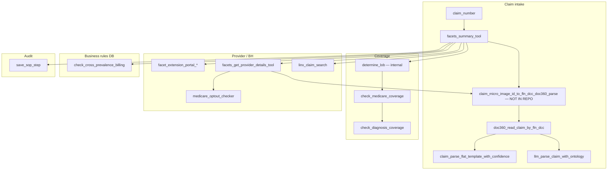

# `src/` — Healthcare Agent Tools & Schemas

This folder is an **extracted slice** of the larger **thynkr-bhagenticai** stack: Python modules that expose **LangChain `StructuredTool`** (and a few `@tool`) wrappers around UnitedHealth/Optum **OBH (Optum Behavioral Health)** claim-processing APIs. They are meant to be called by a **LangGraph / LangChain agent** that follows Facets SOPs (see [`../poc/README.md`](../poc/README.md)).

**What is not in this repo (but required at runtime):**

| Missing piece | Why it matters |
|---------------|----------------|
| `thynkr_bhagenticai` package | Logging (`get_logger`) and in-process `ToolCache` |
| `tools.claim_micro_image_id_to_fln_dcc_doc360_parse` | Central pipeline: Facets claim → FLN/DCC → DOC360 → parsers |
| `config.settings` | Used by `linx_tool` |
| `core.model` | Azure/OpenAI client for `llm_claim_parser` |
| `agents.db_reporting` | SQL table bootstrap for cross-prevalence billing |
| `npi_tool.py` | Only `npi_api_client.py` + `schema_npi_tool.py` remain here |

---

## Directory layout

```
src/
├── README.md                 ← this file
├── .env / .env.stg           ← local secrets (not committed; see Configuration)
└── tools/
    ├── *.py                  ← API clients, parsers, LangChain tools
    └── schemas/
        ├── __init__.py
        └── schema_*.py       ← Pydantic input/output contracts per tool
```

Runtime artifacts (when tools run): `data/tool_cache/`, `data/doc360_*` under the repo root.

---

## How the system is supposed to work

### Big picture

An **agent supervisor** receives a claim number and an SOP step (from POC HTML or internal playbooks). For each step it:

1. Loads **claim context** from **Facets** (summary, lines, COB, eligibility, duplicates).
2. Loads **claim image data** from **DOC360** (by FLN/DCC or via the missing micro-image orchestrator).
3. **Parses** the HCFA print image (regex + LLM).
4. Resolves **LOB** (Medicare / Medicaid / Commercial) and checks **CBD / Diagnosis** coverage.
5. Checks **provider** rules (Facet Extension Portal, opt-out, NPI client).
6. Persists outcomes with **`save_sop_step`** to SQL Server.

POC documents describe **manual Facets UI** steps; tools automate **read-only API lookups** and **structured extraction**—not Facets keypresses (split claim, F3/F4, etc.).

### End-to-end data flow



### Typical agent sequence (claim investigation)

| Order | Action | Module / tool |
|-------|--------|----------------|
| 1 | Get claim header (group, subscriber, provider IDs, micro image id, dates) | `facets_summary_tool` |
| 2 | Resolve FLN/DCC, read DOC360, merge regex + LLM parse | **Missing** `claim_micro_image_id_to_fln_dcc_doc360_parse` (schema: `schema_claim_micro_image.py`) |
| 3 | Or read DOC360 directly if FLN/DCC known | `doc360_read_claim_by_fln_dcc` |
| 4 | Structure print-image text | `llm_parse_claim_with_ontology` and/or `claim_parse_flat_template_with_confidence` |
| 5 | Determine LOB from Facets group/plan text | `lob_determination.determine_lob` (not a standalone tool) |
| 6 | Check CPT coverage for matched group/plan | `check_medicare_coverage` |
| 7 | Check ICD coverage | `check_diagnosis_coverage` |
| 8 | Duplicate / cross-billing / provider / LINX / opt-out as SOP requires | See tool table below |
| 9 | Record step result | `save_sop_step` |

### Provider-details flow (ties Facets + DOC360)

`facets_get_provider_details_tool` calls `_resolve_doc360_parsed_payload`, which **imports the missing orchestrator** to get NPI/TIN from the parsed HCFA, then searches Facets procedure `CMCSP_PRV1_SRCH_PRPR_NAME_REMT` and filters rows by DOC360 NPIs.

---

## Tool registry (agent-visible names)

| Tool name | File | What it does |
|-----------|------|----------------|
| `doc360_read_claim_by_fln_dcc` | `claim_tool.py` | OAuth to DOC360; read claim document by FLN/DCC across classifiers |
| `facets_summary_tool` | `facets_tool.py` | Facets claim summary (group, member, provider entity, micro image id) |
| `facets_cob_tool` | `facets_tool.py` | Coordination of benefits data |
| `facets_line_details_tool` | `facets_tool.py` | Service line details (DOS, CPT, charges) |
| `facets_member_eligibility_tool` | `facets_tool.py` | Member eligibility for benefit checks |
| `facets_get_provider_details_tool` | `facets_tool.py` | Provider search; needs DOC360 parse for NPI/TIN match |
| `facets_duplicate_claim_tool` | `facets_tool.py` | Duplicate claim search by service date ranges |
| `facet_extension_portal_provider` | `facet_extension_portal_tool.py` | BH provider list from Facet Extension Portal |
| `facet_extension_portal_programme` | `facet_extension_portal_tool.py` | Programme data for a provider |
| `facet_ext_portal_group_model` | `facet_extension_portal_tool.py` | Group/network fee schedule model (uses hardcoded staging URL + `get_claim_summary`) |
| `check_medicare_coverage` | `cbd_tool.py` | CBD API: CPT coverage after LOB + group/plan match |
| `check_diagnosis_coverage` | `diagnosis_tool.py` **and** `cbd_tool.py` | Diagnosis API — **duplicate export**; prefer `diagnosis_tool.py` |
| `linx_claim_search` | `linx_tool.py` | LINX BH claim search by subscriber / external account |
| `medicare_optout_checker` | `opt_out_tool.py` | CMS opt-out affidavit lookup |
| `check_cross_prevalence_billing` | `cross_prevalence_billing_tool.py` | SQL lookup: CPT pay/deny from Cross-Billing Prevailing Code List |
| `save_sop_step` | `sop_step_persistence_tool.py` | Upsert one SOP step row to `sop_step_executions` |
| `llm_parse_claim_with_ontology` | `llm_claim_parser.py` | LLM extraction with ontology + JSON schema |
| `claim_parse_flat_template_with_confidence` | `electronic_claim_parser.py` | Regex-first HCFA parse, optional LLM merge |

**Not exported as LangChain tools (supporting code only):**

| Module | Role |
|--------|------|
| `lob_determination.py` | `determine_lob(claim_id)` — Facets summary + CBD catalog similarity |
| `cbd_api_client.py`, `diagnosis_api_client.py`, `npi_api_client.py` | HTTP clients |
| `cbd_config.py` | Static CBD POST payload builder |
| `claim_templates.py` | Canonical HCFA flat field key list for LLM prompts |
| `upload_era_file.py` | CLI: upload Excel from `data/` to Azure Blob (ERA reports) |

---

## Per-file reference (`src/tools/`)

### Claim document & parsing

| File | Why it exists | How it works |
|------|---------------|--------------|
| **`claim_tool.py`** | Agents need raw **DOC360** claim images (keyed/EDI/correspondence). | `Doc360Client`: client-credentials token, `read_claim_by_fln_dcc` tries classifiers `u_keyed_claim`, `u_edi_claim`, `u_clm_corsp_lwso_doc`. Caches via `ToolCache`; may write `data/doc360_envelope-*.json`. |
| **`claim_templates.py`** | Stable field names for HCFA **Box 1–33** extraction prompts. | `EMC_CLAIM_MEDICAL_FLAT_KEYS`, `get_template_keys()`. Used by `llm_claim_parser`. |
| **`electronic_claim_parser.py`** | **Deterministic** parse of DOC360 print image — reduces LLM hallucination. | `ElectronicClaimParser`: regex for diagnoses (Box 21), line items (Box 24), totals, TIN/NPI; merges LLM flat template when used as tool. Deterministic values win on conflict. |
| **`llm_claim_parser.py`** | **LLM-first** parse when layout drifts; ontology + JSON schema. | `llm_parse_claim` via `core.model`; post-validates ICD-10, NPI, money; `ToolCache` keyed by content hash. |

### Facets (core claim system)

| File | Why it exists | How it works |
|------|---------------|--------------|
| **`facets_tool.py`** | Facets is the system of record for claim state, lines, COB, eligibility, duplicates, provider search. | Thread-safe OAuth token (~50 min TTL). Six `StructuredTool`s call REST: summary, COB, line details, member eligibility, provider details (via procedure execute), duplicate claim search. `ProviderDetailsInput` needs claim number to chain DOC360 parse. |

### Coverage & LOB

| File | Why it exists | How it works |
|------|---------------|--------------|
| **`cbd_config.py`** | CBD coverage API expects a fixed POST shape (LOBs, markets, products, filters). | `CBDConfig`, `build_payload(msid, group, plan, products)`. |
| **`cbd_api_client.py`** | Isolate OAuth + POST + CPT filtering for CBD. | `CBDAPIClient.fetch_coverage_data`, `filter_by_cpt_codes` on `descCode`. |
| **`cbd_tool.py`** | Agent asks: “Are these CPTs covered for this claim’s plan?” | If `claim_id` set, lazy-calls `determine_lob`. `match_group_or_plan` uses TF-IDF/cosine + word similarity on CBD customer catalog. Exposes `check_medicare_coverage` (name is historical — works for LOB-resolved plans). **Also duplicates** `check_diagnosis_coverage`. Side effect: may call `cbd_api_info()` at import. |
| **`diagnosis_api_client.py`** | Separate diagnosis benefit API (same OAuth as CBD). | POST with ICD filter on `code`. |
| **`diagnosis_tool.py`** | Agent checks ICD coverage without pulling in full `cbd_tool`. | `check_diagnosis_coverage` → `DiagnosisAPIClient`. |
| **`lob_determination.py`** | Medicare vs Medicaid vs Commercial drives which CBD products/groups apply. | `get_claim_summary` → keyword scan on `GRGR_NAME` + `PDDS_DESC` → else CBD `fetchCustomerInfo` + `match_group_or_plan`. Cached per claim. |

### Provider, portal, ancillary

| File | Why it exists | How it works |
|------|---------------|--------------|
| **`facet_extension_portal_tool.py`** | OBH-specific provider/programme/network model beyond raw Facets. | GET `FACET_EXTENSION_PORTAL_BASE_URL`; group model calls external fee-schedule API with `PRPR_ENTITY` from summary. |
| **`npi_api_client.py`** | Validate NPIs from HCFA fields 11, 24, 33 against CMS registry. | `NPIRegistryClient`: rate-limited GET; no LangChain wrapper in this extract. |
| **`opt_out_tool.py`** | Medicare providers may be opted out of Medicare billing. | `MedicareOptOutChecker` → CMS open data dataset. |
| **`linx_tool.py`** | Cross-system BH claim history by subscriber. | OAuth + POST with `bhRequestHeader`; 24h file cache under `data/tool_cache/`. |

### Rules & persistence

| File | Why it exists | How it works |
|------|---------------|--------------|
| **`cross_prevalence_billing_tool.py`** | Implements **Cross-Billing Prevailing Code List** lookups (duplicate-claim SOP). | First call: `ensure_tables`, bulk-load Excel into SQL; later calls query CPT pairs + modifiers. |
| **`sop_step_persistence_tool.py`** | Audit trail for agent SOP execution. | Idempotent upsert on `(execution_id, claim_id, agent_name, sop_step_number)`; JSON columns as `NVARCHAR(MAX)`. |
| **`upload_era_file.py`** | Ops utility for ERA Excel blobs, not agent-facing. | Azure `BlobServiceClient`, scans `data/*.xlsx`. |

---

## Schemas (`src/tools/schemas/`)

Schemas define **what the agent may pass in** and **what JSON shape comes back**. LangChain uses them as `args_schema` / validation; supervisors and normalizers rely on stable field names.

| Schema file | Main models | Used by |
|-------------|-------------|---------|
| **`schema_claim_tool.py`** | `ClaimContentEnvelope`, `ClaimReadOutput`, `Metadata`, `ErrorDetail`, `TokenResponse` | `claim_tool.py`; referenced by missing micro-image tool |
| **`schema_claim_micro_image.py`** | `ClaimMicroImageOutput`, `ParsedClaimPayload`, `LineItemEntry`, `DiagnosisEntry`, `ClaimFieldValue`, `ToolErrorDetail` | **Orchestrator not in repo**; `facets_tool` expects its output shape |
| **`schema_facets_tool.py`** | `ClaimNumberInput`, `ProviderDetailsInput` | All Facets `StructuredTool`s |
| **`schema_cbd_tool.py`** | `CBDCoverageInput`, `CPTCoverageResult`, `CBDCoverageOutput` | `check_medicare_coverage` |
| **`schema_diagnosis_tool.py`** | `DiagnosisInput`, `DiagnosisResult`, `DiagnosisOutput` | Diagnosis tools |
| **`schema_linx_tool.py`** | `LinxClaimSearchInput`, `LinxClaimSearchOutput`, `ExternalAccountId` | `linx_claim_search` |
| **`schema_facet_extension_portal.py`** | `ProviderInput`, `ProgrammeInput`, `GroupModelInput`, `ClaimIDInput` | Facet extension tools |
| **`schema_optout.py`** | `ProviderOptOutInput`, `ProviderRecord`, `APIResponse` | `medicare_optout_checker` |
| **`schema_npi_tool.py`** | `NPIRegistryInput/Output`, `Provider`, `Address`, `Taxonomy`, … | Intended for missing `npi_tool.py` |

`schemas/__init__.py` is a package marker only; import concrete modules (e.g. `from tools.schemas.schema_facets_tool import ClaimNumberInput`).

### Parsed claim payload hierarchy

When the micro-image orchestrator exists, agents consume:

```
ClaimMicroImageOutput
  ├── parsed: ParsedClaimPayload
  │     ├── fields: dict[str, ClaimFieldValue]   # HCFA flat keys + confidence
  │     ├── diagnoses: list[DiagnosisEntry]
  │     ├── line_items: list[LineItemEntry]
  │     └── totals, other_insurance, hcp_pricing, confidence_scores
  └── error: ToolErrorDetail (on failure)
```

---

## Caching

| Layer | Where | Used by |
|-------|-------|---------|
| In-process `ToolCache` | Memory | DOC360, Facets, CBD, LOB, facet portal, LLM |
| Filesystem `data/tool_cache/{tool}/{hash}.json` | Disk | Diagnosis, medicare coverage, LINX (24h TTL) |
| DOC360 artifacts | `data/doc360_*` | Successful reads in `claim_tool` |
| OAuth tokens | In-memory per module | DOC360 client, Facets thread token, LINX `_token_cache` |

---

## Configuration

Env loading precedence varies by module:

- **`claim_tool`**: `ENV_PATH` → `src/.env.stg`
- **`facets_tool`**: `ENV_PATH` → repo `.env` → `.env.stg`
- Others often load `src/.env` via `dotenv`

Process environment variables **override** file values (containers/CI).

### Environment variables (by integration)

| Integration | Variables |
|-------------|-----------|
| **DOC360** | `DOC360_TOKEN_URL`, `DOC360_CLIENT_ID`, `DOC360_CLIENT_SECRET`, `DOC360_API_BASE`, `DOC360_SCOPE`, `DOC360_READ_DOCUMENT_CONTENT`, `DOC360_APP_ID`, `DOC360_USER_ID`, `UPSTREAM_ENV`, `DOC360_DEBUG` |
| **Facets** | `FACETS_BASE_URL`, `FACETS_USERNAME`, `FACETS_PASSWORD`, `FACETS_REGION`, `FACETS_IDENTITY`, `FACETS_SIGNON_METHOD`, `REQUEST_TIMEOUT`, `SSL_VERIFY` |
| **CBD / Diagnosis OAuth** | `CBD_TOKEN_URL`, `CBD_CLIENT_ID`, `CBD_CLIENT_SECRET` |
| **CBD APIs** | `CBD_API_URL`, `CBD_CONFIG_API_URL`, `CBD_API` (customer catalog), `CBD_MSID`, `CBD_TIMEOUT`, `CBD_VERIFY_SSL` |
| **Diagnosis** | `DIAGNOSIS_API_URL` |
| **LINX** | `LINX_AUTH_URL`, `LINX_CLIENT_ID`, `LINX_CLIENT_SECRET`, `LINX_API_URL` + `config.settings` |
| **Facet Extension Portal** | `FACET_EXTENSION_PORTAL_BASE_URL` |
| **CMS Opt-out** | `CMS_API_BASE_URL`, `CMS_DATASET_ID`, `CMS_API_TIMEOUT` |
| **NPI Registry** | `NPI_API_BASE_URL`, `NPI_API_VERSION`, `NPI_RATE_LIMIT_CALLS`, `NPI_RATE_LIMIT_PERIOD` |
| **Azure ERA upload** | `AZURE_STORAGE_CONNECTION_STRING`, `AZURE_CONTAINER_NAME` |
| **SQL** | `sql_dsn` per tool call: `server:port;database;user;password` |
| **LLM** | Via `core.model` / `.env.stg`: deployment names, `LLM_CLAIM_PARSER_AGENT_NAME`, `AGENT_MODEL_MAP` |

---

## How this will evolve (intended full stack)

1. **`claim_micro_image_id_to_fln_dcc_doc360_parse`** restored — wires `facets_summary` → FLN/DCC → `claim_tool` → `electronic_claim_parser` + `llm_claim_parser` → `ClaimMicroImageOutput`.
2. **`npi_tool.py`** restored — wraps `npi_api_client` with `schema_npi_tool`.
3. **Agent supervisor** maps each POC SOP step number to tool names + `save_sop_step`.
4. **POCs stay reference HTML**; tools supply facts; Facets UI actions remain human or RPA.

---

## POC ↔ tool mapping (quick reference)

| POC topic | Primary tools |
|-----------|----------------|
| Claims spanning eligibility | `facets_member_eligibility_tool`, `facets_line_details_tool`, `facets_summary_tool` |
| Duplicate claim handling | `facets_duplicate_claim_tool`, `check_cross_prevalence_billing`, `facets_summary_tool` |
| Timely filing | `facets_cob_tool`, `facets_summary_tool`, `facets_line_details_tool`, `doc360_read_claim_by_fln_dcc` |
| Provider selection | `facets_get_provider_details_tool`, `doc360_read_claim_by_fln_dcc`, `llm_parse_claim_with_ontology` |
| Physician checklist | `doc360_read_claim_by_fln_dcc`, `llm_parse_claim_with_ontology`, `facets_*`, `check_diagnosis_coverage` |

Full SOP narratives: [`../poc/README.md`](../poc/README.md).

---

## Running locally (minimal)

1. Install parent package `thynkr_bhagenticai` and dependencies (`langchain`, `httpx`, `requests`, `pydantic`, `sklearn`, `pymssql`, …).
2. Place secrets in `src/.env.stg` or export env vars.
3. Import tools from the parent app’s tool registry (this extract does not include a standalone `main`).

**Import path note:** Some files use `from tools.X` (parent repo layout); others use relative `from .X`. Run with `PYTHONPATH` including the parent `src` root.
